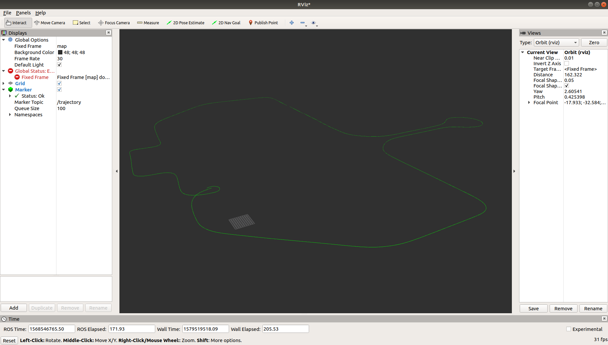
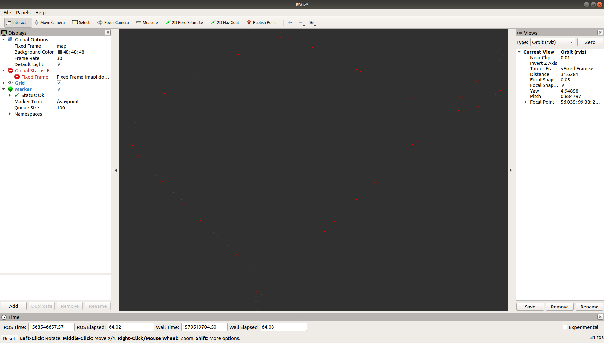
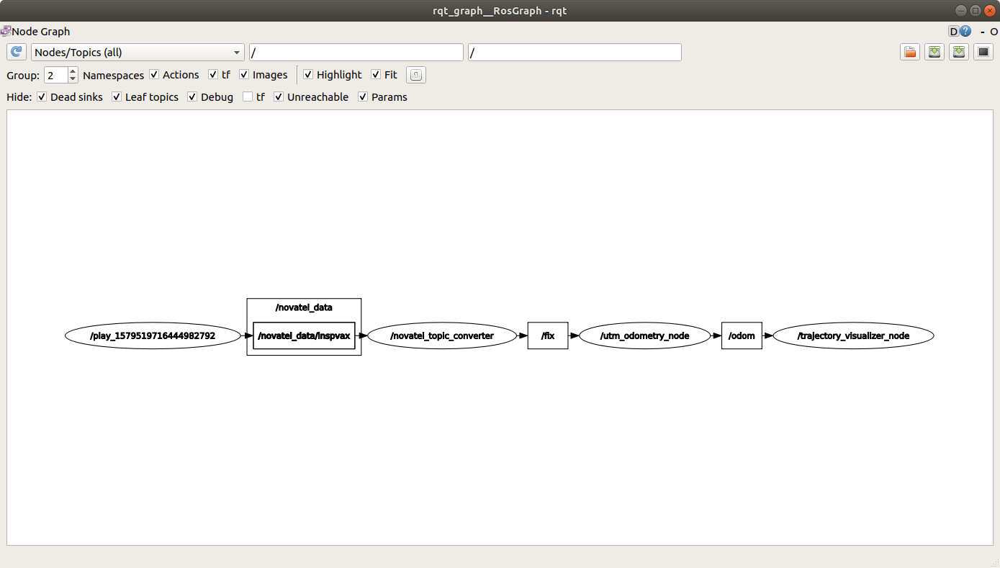

# trajectory_visualizer
***trajectory_visualizer*** is an open source ROS package for visualize existing waypoints and platform's current trajectory.

## Nodes
***trajectory_visualizer*** consists of only one node.

- *trajectory_visualizer_node*

## Requirements
***trajectory_visualizer*** requires following arguments.

- *Vehicle's position data base upon UTM-Coordinates.*
- *.csv file with waypoint recorded.*

## Messages
- Subscribed Topics
  - */odom* (navsat_msgs/Odometry)
    - If necessary, this topic can be displaced to other topics (*ex. sensor_msgs/NavSatFix, geometry_msgs/PoseStamped, etc.*) 
- Published Topics
  - */waypoint* (visualization_msgs/Marker)
  - */trajectory* (visualization_msgs/Marker)

## Parameters
- *file_path*
  - Indicates the path of .csv file.
- *pose_x_offset*
- *pose_y_offset*
- *waypoint_x_offset*
- *waypoint_x_offset*
  - Coordinates offset for visualizing in rviz.
